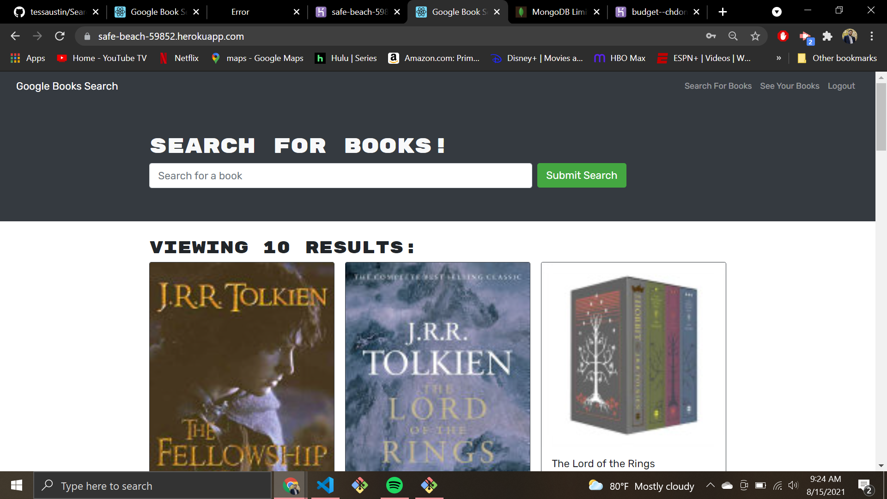
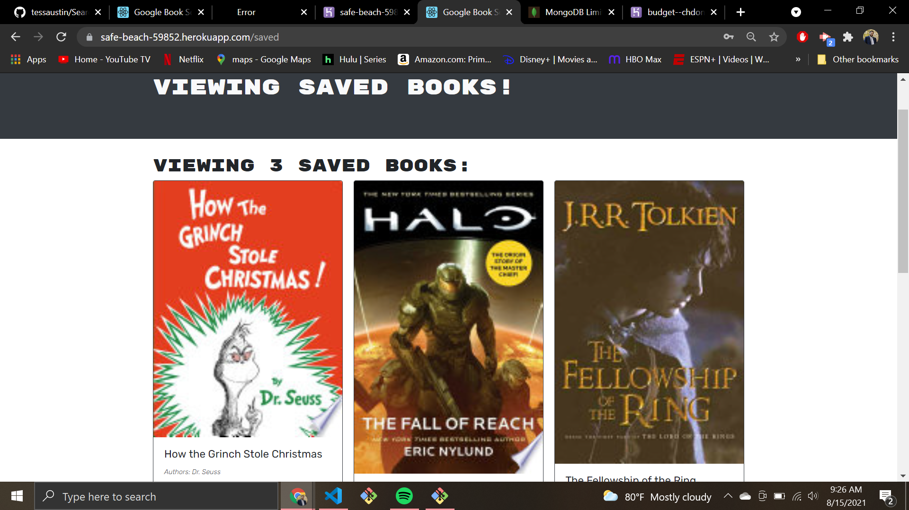

# Search-a-Book

## Description:
This Google Books search engine is built using the MERN stack: MongoDB, Express.js, React, and Node.js. As a user you can create an account, search for books and save those books to a personal list.

## Licensing:

## Table of Contents 
* [Description](#description)
* [Usage](#usage)
* [Technology](#technology)
* [Questions](#questions)
* [Screenshot](#Screenshot)

## Usage:

https://safe-beach-59852.herokuapp.com/

## Technology:
- MongoDB
- Express.js
- React.js
- Node.js
- Heroku

## Questions:
Please reach me through my Github account or my email with any additional questions.
- Github: [chdonovan](https://github.com/chdonovan)
- Email: chrisodnovan311@gmail.com 

## Screenshot:

